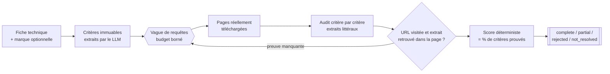

# Moteur d'équivalence

[](https://github.com/1MedAmine/moteur-equivalence/actions/workflows/ci.yml)


**Trouver l'alternative de n'importe quel produit à partir de sa fiche
technique, et prouver chaque critère par un extrait lu sur une page réellement
téléchargée.**

> **In English:** an LLM-assisted engine that finds an orderable substitute
> for any product described by a technical datasheet, when the original is
> discontinued or only sold by a competitor.
> The LLM reads pages and extracts values; deterministic Python code checks
> every quoted excerpt against the downloaded page and computes the score.
> Bounded search budget, offline replay of real runs, 978 tests that run with
> no network and no API key. This is the fifth architecture, after four
> abandoned ones. See the [design log](docs/journal-de-conception.md)
> (in French).

---

## Le problème

Demander à un LLM l'équivalent d'un produit donne toujours une réponse. Savoir
si elle est vraie, c'est une autre affaire.

Sur un run réel décrit dans le
[journal de conception](docs/journal-de-conception.md), une version où le
modèle rédigeait la réponse *et* notait sa propre confiance a rendu quatre
équivalents « certains ». Les quatre étaient faux, et deux d'entre eux
portaient le même code produit chez deux fabricants concurrents : une
référence inventée.

Ce moteur part du principe inverse : **le modèle lit, le code juge.** Aucun
critère n'est accepté sans un extrait retrouvé mot pour mot sur une page
réellement téléchargée.

## Pour quels produits

Le moteur ne connaît aucune famille de produits à l'avance. Les critères ne
sont pas écrits dans le code : le modèle les lit dans la fiche technique
fournie, que ce soit la tension et le courant d'un contacteur, les cotes d'un
roulement ou la matière et le grammage d'un textile. Deux conditions suffisent :

1. le produit de départ a une fiche technique ;
2. les caractéristiques de l'alternative sont écrites sur une page web.

Il a été testé en conditions réelles sur des contacteurs (électrique) et des
roulements (mécanique).

## Comment ça marche



| Étape | Ce que fait le modèle | Ce que fait le code (déterministe) |
| --- | --- | --- |
| Critères | extrait les critères de la fiche | vérifie qu'aucun couple nombre + unité de la fiche n'a été oublié |
| Recherche | propose des requêtes | impose le budget, répartit les requêtes sur sept moteurs, écarte le bruit avant d'ouvrir une page |
| Audit | cite un extrait par critère | vérifie que l'URL a été visitée et que l'extrait existe **mot pour mot** dans la page |
| Verdict | rien | calcule le score (% de critères prouvés) et attribue le statut |

Le pourcentage n'est donc jamais une confiance inventée par le modèle.

## Essayer en deux minutes, sans clé ni réseau

```powershell
python -m venv .venv
.venv\Scripts\python.exe -m pip install -r requirements.txt
.venv\Scripts\python.exe -m pytest -q
.venv\Scripts\python.exe rejouer.py --corpus .replay/demonstration
```

Sous Linux ou macOS, remplacer `.venv\Scripts\python.exe` par
`.venv/bin/python`.

Le rejeu relit un corpus de démonstration livré dans le dépôt, sans réseau,
sans modèle et sans clé. Résultat attendu : deux alternatives retenues à
100 %, et une troisième écartée parce que sa page indique 48 V au lieu des
24 V demandés.

## Exemple réel : roulement SKF 6205-2RSH

Entrée : la fiche SKF d'un roulement à billes de **25 × 52 × 15 mm** avec un
joint des deux côtés
([table dimensionnelle](https://cdn.skfmediahub.skf.com/api/public/0901d196802809de/pdf_preview_medium/0901d196802809de_pdf_preview_medium.pdf),
[documentation des joints](https://www.skf.com/binaries/pub12/Images/SKF%20Explorer%20deep%20groove%20ball%20bearings%20with%20RSL%20and%20RSH%20seals_6270%20EN_tcm_12-179206.pdf)),
sans marque concurrente imposée.

| Alternative trouvée | Score | Statut |
| --- | ---: | --- |
| [Codex 6205 2RS](https://sdn-distrib.com/roulements/roulement-a-billes-6205-2rs-diametre-25x52x15mm-etanche-eau-et-poussiere-codex.html) | 100 % | `partial` |
| [DPI 6205-2RS](https://platinum-international.store/fr/product/dpi-6205-2rs-deep-groove-ball-bearing/) | 100 % | `partial` |

Les quatre critères sont prouvés par des extraits retrouvés mot pour mot sur
chaque page. Le statut reste `partial` parce que chaque preuve vient d'un seul
distributeur, pas du site du fabricant.

## Choix d'ingénierie

**1. Une preuve est une page, pas une affirmation.** Le modèle propose des
statuts, mais le code refuse un critère `proven` sans extrait vérifiable dans
le texte réellement récupéré.

**2. Celui qui cherche ne juge pas.** La découverte (requêtes, pistes de
références) et la preuve sont deux étapes séparées. Une piste sert à préparer
une requête ciblée ; elle n'est jamais une preuve. C'est la seule décision
d'architecture qui a survécu aux cinq générations du moteur.

**3. Un run réel se fige et se rejoue hors ligne.** Le réseau n'est pas
reproductible : un distributeur qui répond `200` aujourd'hui répond `403`
demain, et sa preuve disparaît avec lui. Un corpus de rejeu capture un run
entier pour le rejouer sans réseau ni modèle, à l'identique.
Voir [Rejeu local de diagnostic](#rejeu-local-de-diagnostic)

**4. Le bruit se mesure, puis se filtre avant d'ouvrir la page.** Sur un run
réel, SearXNG a remonté cinq pages Stack Overflow sur le cache navigateur :
160 s de `403`, soit 72 % du temps perdu du run. Ces domaines, et les pages
éditoriales du type « qu'est-ce qu'un contacteur », sont maintenant écartés
avant ouverture.
Voir [Pages écartées avant ouverture](#pages-écartées-avant-ouverture)

**5. Aucune marque n'est connue du code.** La connaissance des marques
(domaines officiels, alias) vit dans un fichier de configuration
([`marques.exemple.json`](marques.exemple.json)). Sinon, le moteur deviendrait
bon sur ses cas de test et sur rien d'autre.

**6. Des tests qui tiennent sans rien.** 978 tests tournent en CI sans clé
d'API, sans base de données et sans réseau sortant : un test qui aurait besoin
de l'un des trois échouerait.

## Limites

Un dépôt qui cache ses trous fait perdre plus de temps qu'il n'en fait gagner.

- **Un seul fabricant cherché à la fois.** Quand plusieurs marques sont
  visées, la recherche ne porte que sur la première ; les autres sont
  seulement filtrées dans ce que la première a remonté. **Ne rien trouver chez
  une autre marque visée ne prouve donc rien**, pas même qu'elle a réellement
  été cherchée.
- **Un budget borné n'est pas une preuve d'absence.** Au maximum 12 requêtes,
  36 appels aux moteurs de recherche et 36 pages ouvertes par mission.
  `not_resolved` veut dire « non prouvé dans ce budget », jamais « n'existe
  pas ».
- **Une source unique ne suffit pas pour `complete`.** Il faut une preuve sur
  un domaine fabricant reconnu, ou sur au moins trois domaines indépendants. Un
  fabricant qui ne publie rien de lisible peut donc rester hors de portée.
- **Aucun corpus réel publié.** Les marques et pages du corpus de
  démonstration sont inventées. L'exemple SKF donne des liens et de courts
  extraits vérifiés, mais ses pages capturées ne sont pas publiées.
- **La passe vision est hors service.** Le modèle par défaut
  (`nvidia/nemotron-nano-12b-v2-vl`) a été retiré par son fournisseur le
  2026-08-26, et le remplaçant testé s'est montré instable (erreurs 500 et
  503, réponses non conformes). Seul le chemin fiche **PDF** en dépend ; le
  point d'entrée JSON (`cli.py`) ne l'utilise jamais.
- **Le rejeu reproduit le verdict, pas encore chaque piste.** Statut,
  candidat retenu et score se rejouent à l'identique ; les pistes
  intermédiaires (`candidate_leads`) pas toujours.
- **Des contrôles réglés sur les produits techniques.** La recherche et la
  preuve sont génériques, mais deux contrôles de sécurité s'appuient sur une
  liste d'unités (V, A, Hz, mm, kg, bar, °C…) : celui qui vérifie qu'aucun
  chiffre de la fiche n'a été oublié, et celui qui vérifie la cohérence entre
  un critère et son unité. Sur un produit décrit avec d'autres unités, ils
  vérifient moins de choses sans bloquer la recherche. La consigne envoyée au
  modèle parle aussi encore d'« alternative industrielle ».
- **Un critère doit être écrit pour être prouvé.** « Même style » ou « même
  confort » ne se retrouvent sur aucune page : de tels critères restent
  `not_proven`.
- **Le filtrage du bruit reste partiel.** Sur un run mesuré, 14 des 36 pages
  ouvertes étaient hors sujet ; le filtre en a écarté 9.
- **Un libellé de diagnostic est incohérent.** Sur le run SKF, `stop_reason`
  vaut `NO_PROVABLE_CANDIDATE` alors que `final_state` vaut
  `candidate_selected`. Le verdict n'est pas affecté ; le libellé reste à
  corriger.

## Stack technique

| Rôle | Outils |
| --- | --- |
| LLM | NVIDIA Nemotron 3 Super 120B, via l'API NVIDIA (compatible OpenAI) |
| Extraction structurée | ScrapeGraphAI 2.1.6 (LangChain 1.x), Pydantic |
| Recherche web | SearXNG auto-hébergé, sept moteurs en rotation |
| Récupération des pages | Scrapling (`Fetcher`, `StealthyFetcher` via patchright), Camoufox |
| Fiches PDF | PyMuPDF, Camelot |
| Tests | pytest, Hypothesis, GitHub Actions |

Environ 16 000 lignes de Python. Les modules principaux :

| Module | Rôle |
| --- | --- |
| [`recherche_adaptative.py`](recherche_adaptative.py) | orchestration des vagues de recherche |
| [`planification.py`](planification.py) | extraction des critères et préparation des requêtes |
| [`compatibilite.py`](compatibilite.py) | validation des preuves et calcul déterministe du score |
| [`candidats.py`](candidats.py) | pistes de références, sans valeur de preuve |
| [`scraping.py`](scraping.py) | récupération des pages en trois paliers |
| [`rejeu.py`](rejeu.py) | capture et rejeu d'un run sans réseau ni modèle |
| [`rapport.py`](rapport.py) | sorties JSON et Markdown |

---

# Documentation technique

## Deux points d'entrée

| Entrée | Pour qui | Forme |
| --- | --- | --- |
| `outil.py` | un humain | ligne de commande, prend une fiche sur disque |
| `cli.py` | un système appelant | JSON sur l'entrée standard, JSON sur la sortie |

Ce moteur a été construit comme composant d'un système plus large, non publié
ici. `cli.py` est la frontière : il reçoit un cahier des charges déjà
construit, le met en forme de fiche, lance le moteur et rend sa sortie telle
quelle.

Dans le code et les variables d'environnement, le moteur porte son nom de
génération, `B2` : la cinquième et dernière architecture essayée, la seule
publiée. Le [journal de conception](docs/journal-de-conception.md) raconte les
quatre autres.

## Installation

### Prérequis

- **Python 3.12 ou 3.13.**
- **Une instance SearXNG** sur `http://localhost:8080`, avec la sortie
  `json` activée dans ses `formats`. ScrapeGraphAI 2.1.6 impose ce port local.
- **Une clé d'API NVIDIA**, à créer sur
  [build.nvidia.com](https://build.nvidia.com).

### Étapes

Le moteur utilise son propre environnement virtuel : ScrapeGraphAI dépend de
LangChain 1.x, une contrainte de version qui n'a pas à se propager à qui
l'embarque. C'est la raison concrète de la frontière de processus de `cli.py`.

```powershell
python -m venv .venv
.venv\Scripts\python.exe -m pip install -r requirements.txt
.venv\Scripts\patchright.exe install chromium
.venv\Scripts\scrapling.exe install
.venv\Scripts\camoufox.exe fetch
Copy-Item .env.example .env
```

Le navigateur est installé par `patchright`, pas par `playwright` : Scrapling
pilote le mode furtif via patchright, dont les binaires sont distincts. Sans
cette commande, `StealthyFetcher` échoue au lancement et le moteur perd le
deuxième palier de récupération. `camoufox fetch` installe le troisième : un
moteur Firefox, tenté seulement quand les deux premiers ont échoué sur un hôte
qui bloque spécifiquement Chromium.

Renseigner uniquement `B2_API_KEY` dans `.env`, fichier ignoré par Git. Le
moteur accepte aussi, dans cet ordre, `NVIDIA_API_KEY` puis
`INDUSTRIAL_API_KEY`. Aucune commande de diagnostic n'affiche une partie de la
clé.

## Utilisation

```powershell
.venv\Scripts\python.exe outil.py `
  --fiche C:\chemin\fiche.pdf `
  --marque Vantek `
  --output-dir resultats
```

`--marque` est facultatif ; lorsqu'il est présent, il impose la marque de
l'alternative. La commande écrit `alternative.json` et `alternative.md`.

Codes de sortie :

- `0` pour `complete`, `partial`, `rejected` ou `not_resolved` ;
- `1` pour `invalid_input`, `configuration_error`, `service_unavailable` ou
  `analysis_error`.

## Flux détaillé

1. Une fiche texte est conservée telle quelle. Pour un PDF, PyMuPDF extrait le
   texte et détecte les pages tabulaires ; Camelot est appelé une seule fois,
   en lot, uniquement sur ces pages.
2. ScrapeGraphAI transforme la fiche en critères immuables. Un compteur
   mécanique compare ensuite les nombres + unités et les lignes tabulaires au
   `RequirementSet`. Une seconde passe vision, ciblée sur les seuls tableaux
   concernés, n'est lancée qu'en présence d'oublis ; la fusion déduplique sans
   modifier la première passe.
3. Nemotron produit des requêtes complémentaires : trois au plus par vague,
   douze pour la mission.
4. Chaque requête part vers un moteur SearXNG déterminé. Un moteur bloqué,
   vide, en erreur ou incorrect est remplacé par le suivant, avec trois essais
   au maximum.
5. Les résultats sont dédupliqués ; au plus douze nouvelles pages sont ouvertes
   par vague, dans la limite de trente-six pour la mission.
6. Scrapling essaie `Fetcher`, puis `StealthyFetcher` (deux moteurs Chromium).
   S'ils échouent sur un hôte qui n'a pas déjà opposé le même refus, Camoufox
   (Firefox) prend le relais. Si les trois échouent, ScrapeGraphAI charge
   lui-même l'URL.
7. ScrapeGraphAI audite chaque candidat critère par critère, avec des extraits
   littéraux.
8. Python vérifie que chaque URL a été visitée et que chaque extrait existe
   réellement dans le contenu récupéré, puis calcule le score.
9. Le moteur reformule ses requêtes à partir des critères manquants, sur
   quatre vagues au maximum. Un candidat complet n'arrête pas la mission : les
   vagues restantes collectent les autres propositions admissibles.

## Découverte puis preuve ciblée

```text
vague générale -> pistes littérales -> requêtes référence exacte
-> audits ScrapeGraphAI ciblés -> fusion de preuves -> score déterministe
```

Une piste est une identité de marque et de référence observée littéralement ;
elle sert seulement à préparer des requêtes ciblées. Des pistes peuvent donc
exister alors que le statut final reste `not_resolved`, faute de preuves
techniques vérifiables sur les pages consultées. Si la planification ciblée est
indisponible, le moteur reprend une vague générale dans les mêmes budgets.

## Moteurs SearXNG

Sept raccourcis, utilisés en rotation circulaire :

```text
bi, ddg, goc, nvr, szn, qw, sp
```

Soit Bing, DuckDuckGo, Google CSE, Naver, Seznam, Qwant et Startpage. Le moteur
ne modifie pas la configuration globale de SearXNG ; il utilise l'instance
existante.

## Compatibilité déterministe

Pour chaque critère, ScrapeGraphAI rend l'un de ces états :

- `proven` : valeur demandée explicitement prouvée ;
- `not_proven` : information absente ;
- `incompatible` : valeur différente prouvée.

Le code calcule ensuite :

```text
score = 100 × critères prouvés ÷ nombre total de critères
```

| Statut | Condition |
| --- | --- |
| `complete` | 100 %, marque cible respectée, aucune incompatibilité, preuve officielle ou trois domaines indépendants |
| `partial` | au moins 75 %, sans incompatibilité critique prouvée, mais sans corroboration suffisante pour `complete` |
| `rejected` | incompatibilité prouvée, sans candidat qu'une autre page sauve |
| `not_resolved` | moins de 75 % ou preuve insuffisante, sans incompatibilité prouvée |

S'y ajoute un statut d'erreur, `service_unavailable` : aucun résultat
exploitable et au moins un appel au LLM limité par un HTTP 429. Un résultat
`partial` n'est rendu que si aucun candidat `complete` n'a été trouvé.

## Pages écartées avant ouverture

Un moteur de recherche ne sait pas ce qu'est une fiche technique. Mesure d'un
run réel sur un contacteur : SearXNG a remonté cinq pages Stack Overflow sur le
cache navigateur. Les trois paliers de récupération s'y sont acharnés : 160 s
de `403`, soit 72 % du temps perdu du run. Elles ont aussi occupé cinq des trente-six
places du budget de pages.

Ces domaines sont donc écartés **avant ouverture** : ils ne coûtent ni temps de
récupération ni place dans le budget. Le filtre juge la pertinence, pas la
lisibilité : une page Stack Overflow se lit très bien, elle n'a simplement rien
à prouver ici. Les pages écartées sont listées dans
`diagnostics.offtopic_urls_skipped`, pour vérifier qu'il coupe le bruit et non
des pages produit.

Une liste de domaines ne suffit pas : le bruit change de domaine à chaque run.
Sur un run suivant, avec la même fiche, sept des trente-six pages ouvertes
étaient des articles pédagogiques (« what is a contactor in electrical »,
« qu'est-ce qu'un contacteur moteur », « glossaire-electricite »…), publiés
sur des sites d'électricité parfaitement légitimes. Le run a rendu `rejected`
sans avoir ouvert une seule page produit.

Un second filtre écarte donc les chemins éditoriaux (`/glossaire`,
`definition-`, `what-is-a-`, `/forum/`, `/blog/`, `/guides/`, `/wiki/`) : une
page produit n'annonce jamais qu'elle est une définition. Vérifié sur les URLs
réellement ouvertes des deux runs, il ne touche aucune page produit.

`B2_EXCLUDED_DOMAINS` complète la liste par défaut sans la remplacer :

```powershell
$env:B2_EXCLUDED_DOMAINS = "exemple-bruit.fr,autre-bruit.com"
```

## Navigateurs et audits : deux budgets distincts

`B2_MAX_SCRAPER_WORKERS` borne les navigateurs, qui occupent de la mémoire.
`B2_MAX_ANALYSIS_WORKERS` borne les audits LLM, qui n'occupent qu'une socket.
Les confondre obligeait à sérialiser les audits dès qu'on réduisait le nombre
de navigateurs, sans aucun gain de mémoire.

## Cache de pages

Une page récupérée avec succès est écrite dans `B2_PAGE_CACHE_DIR` et relue
pendant `B2_PAGE_CACHE_TTL_HOURS`. Le cache est actif par défaut ; un dossier
vide ou une durée de vie nulle le désactive :

```powershell
$env:B2_PAGE_CACHE_DIR = ""
```

Trois garanties :

- **Seuls les succès sont écrits.** Figer un `403` transitoire le rendrait
  permanent pendant toute la durée de vie de l'entrée.
- **Une page relue le dit.** L'avertissement `page servie depuis le cache
  local, récupérée le ...` l'accompagne jusqu'au rapport : une preuve datée ne
  se fait jamais passer pour fraîche.
- **Un échec du cache ne coûte qu'un aller réseau.** Entrée illisible,
  corrompue, périmée ou datée dans le futur : tout se traduit par un manque,
  jamais par une exception.

Ce cache sert les runs réels ; il est distinct du corpus de rejeu, qui fige un
run entier.

## Rejeu local de diagnostic

Le dépôt livre un corpus fabriqué dans `.replay/demonstration/` (voir
[Essayer en deux minutes](#essayer-en-deux-minutes-sans-clé-ni-réseau)). Pour
capturer un run réel, définir `B2_REPLAY_DIR` vers un **nouveau** dossier
local ; un dossier existant est refusé pour ne jamais mélanger deux runs :

```powershell
$env:B2_REPLAY_DIR = ".replay/run-01"
.venv\Scripts\python.exe outil.py --fiche C:\chemin\fiche.pdf --output-dir resultats\run-01
```

Le dossier contient `pages.json`, `audits.json`, `requirements.json` et
`manifest.json`. Il se rejoue ensuite sans réseau, sans LLM et sans
ScrapeGraphAI :

```powershell
.venv\Scripts\python.exe rejouer.py --corpus .replay\run-01
```

Un corpus capturé contient le texte brut des pages : il reste un artefact de
debug local, ignoré par Git (seul `.replay/demonstration/`, fabriqué, est
versionné) et jamais recopié dans `alternative.json`. La capture, elle, est un
run réel : elle consomme l'API NVIDIA et interroge les moteurs publics.

## Paramètres

Les valeurs invalides provoquent `configuration_error` ; elles ne retombent
jamais silencieusement sur un défaut.

<details>
<summary>Variables d'environnement et valeurs par défaut</summary>

| Variable | Défaut |
| --- | --- |
| `B2_MODEL` | `nvidia/nemotron-3-super-120b-a12b` |
| `B2_VISION_MODEL` | `nvidia/nemotron-nano-12b-v2-vl` (retiré, voir [Limites](#limites)) |
| `B2_ENABLE_THINKING` | `true` |
| `B2_REASONING_BUDGET` | `8192` |
| `B2_TEMPERATURE` | `0.1` |
| `B2_LLM_TIMEOUT` | `180.0` s |
| `B2_NETWORK_TIMEOUT` | `25.0` s |
| `B2_SEARXNG_URL` | `http://localhost:8080` |
| `B2_MAX_SCRAPER_WORKERS` | `2` |
| `B2_MAX_ANALYSIS_WORKERS` | `2` |
| `B2_SCRAPER_RATE_LIMIT_DELAY` | `0.5` s |
| `B2_MAX_RESULTS_PER_QUERY` | `12` |
| `B2_DISTRIBUTOR_DOMAINS` | `distributeur-a.example,distributeur-b.example,distributeur-c.example,distributeur-d.example` |
| `B2_ADAPTIVE_MAX_WAVES` | `4` |
| `B2_ADAPTIVE_QUERIES_PER_WAVE` | `3` |
| `B2_ADAPTIVE_ENGINE_ATTEMPTS` | `3` |
| `B2_ADAPTIVE_PAGES_PER_WAVE` | `12` |
| `B2_MIN_COMPATIBILITY_PERCENT` | `75` |
| `B2_PAGE_CACHE_DIR` | `.cache_pages` |
| `B2_PAGE_CACHE_TTL_HOURS` | `168.0` (7 jours) |
| `B2_EXCLUDED_DOMAINS` | vide (complète la liste par défaut) |
| `B2_MARQUES_CONNUES` | `marques.exemple.json` |

</details>

## Tests et vérification locale

```powershell
.venv\Scripts\python.exe -m pytest -q
.venv\Scripts\python.exe -m pip check
.venv\Scripts\python.exe verifier_installation.py --hors-ligne
```

Aucune de ces commandes n'effectue de recherche web.

---

## Licence

MIT, voir [`LICENSE`](LICENSE).
