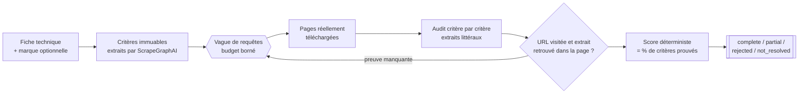

# Moteur d'équivalence

**Une pièce demandée n'est plus au catalogue, ou seulement disponible chez un
concurrent.** Ce moteur cherche une référence commandable qui puisse la
remplacer, et ne rend jamais un candidat sans les preuves — lues sur des
pages réellement téléchargées — qui montrent qu'il en est vraiment un.

---

## En quelques minutes



Le modèle de langage ne fait que lire une page et en extraire des valeurs :
la vérification, le score et le classement sont du code déterministe, pas un
jugement du modèle.

### Ce qui vaut le détour

**1. Une preuve est une page, pas une affirmation.** Le moteur ne demande
jamais à un modèle de juger. Sur un run réel documenté dans le journal de
conception, un mode où le modèle rédigeait *et* notait sa propre confiance a
rendu quatre équivalents « certains » dont quatre étaient faux — dont deux
partageaient un code produit entre fabricants concurrents, signal net de
fabrication pure.
→ [`docs/journal-de-conception.md`](docs/journal-de-conception.md)

**2. Un corpus de rejeu fige un vrai run pour le rejouer hors ligne.** Le
réseau n'est pas reproductible : un distributeur qui répond `200` aujourd'hui
répond `403` demain, et la preuve qu'il portait disparaît avec lui. Ce dépôt
livre un corpus fabriqué (`scripts/fabriquer_corpus_rejeu.py`) qui se rejoue
sans réseau, sans clé et sans modèle.
→ [Rejeu local de diagnostic](#rejeu-local-de-diagnostic)

**3. Le bruit se mesure, et se filtre avant d'ouvrir la page.** Mesure d'un
run réel : SearXNG a remonté cinq pages Stack Overflow traitant du cache
navigateur, sur lesquelles les trois modes de récupération se sont acharnés —
160 s de `403`, 72 % du temps perdu du run. Un run suivant, sur la même
fiche, a ouvert sept pages pédagogiques (« qu'est-ce qu'un contacteur »)
plutôt qu'une seule page produit. Les deux motifs de bruit sont maintenant
écartés avant ouverture, pas après lecture.
→ [Pages écartées avant ouverture](#pages-ecartees-avant-ouverture)

---

## Limites

Un dépôt qui cache ses trous fait perdre plus de temps qu'il n'en fait
gagner. Voici les nôtres, et elles ne sont pas un détail en bas de page.

- **La recherche ne restreint qu'à UN fabricant à la fois.** Quand plusieurs
  marques sont visées, la recherche ne porte que sur la première ; les
  autres sont filtrées après coup sur ce que la première a remonté, jamais
  cherchées pour elles-mêmes. **Ne rien trouver chez une autre marque visée
  ne prouve donc rien** : ni qu'elle n'a pas d'équivalent, ni que la
  recherche l'a seulement cherché en vain.
- **Un budget borné n'est pas une preuve d'absence.** Douze requêtes
  logiques, trente-six appels moteur, trente-six pages ouvertes au maximum
  par mission. `not_resolved` veut dire « non prouvé dans ce budget », jamais
  « n'existe pas ».
- **La preuve directe exige un domaine fabricant reconnu.** Un distributeur
  ou une place de marché peut suggérer une référence, jamais la prouver
  seul : il faut une page officielle, ou le recoupement d'au moins deux
  domaines indépendants. Un fabricant qui ne publie rien en ligne dans une
  forme que le moteur puisse lire reste hors de portée, même quand la
  référence existe réellement.
- **Aucune donnée réelle.** Les marques, références et pages de démonstration
  et de test sont entièrement inventées (voir
  [`marques.exemple.json`](marques.exemple.json) et
  [`scripts/fabriquer_corpus_rejeu.py`](scripts/fabriquer_corpus_rejeu.py)) :
  aucun catalogue, aucune fiche, aucun contenu web réel n'est publié dans ce
  dépôt.

---

## Essayer sans rien configurer

```powershell
python -m venv .venv
.venv\Scripts\python.exe -m pip install -r requirements.txt
.venv\Scripts\python.exe -m pytest -q
.venv\Scripts\python.exe rejouer.py --corpus .replay/demonstration
```

Le rejeu ci-dessus ne touche ni le réseau ni un modèle : il relit le corpus
livré dans ce dépôt et recalcule le score à partir des preuves qu'il
contient. C'est la démonstration la plus honnête du moteur, et elle ne
demande aucune clé.

Faire tourner la recherche pour de vrai (web, LLM) demande une installation
plus lourde : voir [Installation](#installation).

## Liens

| Où | Quoi |
| --- | --- |
| [`docs/journal-de-conception.md`](docs/journal-de-conception.md) | Cinq générations de ce moteur, quatre abandonnées, et ce que chacune a appris. |
| [`LICENSE`](LICENSE) | MIT. |

---

## Deux points d'entrée

| Entrée | Pour qui | Forme |
| --- | --- | --- |
| `outil.py` | un humain | ligne de commande, prend une fiche sur disque |
| `cli.py` | un système appelant | JSON sur l'entrée standard, JSON sur la sortie |

Ce moteur a été construit comme composant d'un système appelant plus large,
non publié dans ce dépôt. `cli.py` est la frontière : il reçoit un cahier des
charges déjà construit, le met en page sous forme de fiche, lance le moteur
et rend sa sortie telle quelle — la traduction vers le vocabulaire de cet
appelant se fait de son côté de la frontière, pas ici.

Dans le code et dans les variables d'environnement, le moteur porte son nom
de génération, `B2` : c'est la cinquième et dernière des architectures
essayées, la seule publiée. [`docs/journal-de-conception.md`](docs/journal-de-conception.md)
raconte les quatre autres.

## Installation

Le moteur utilise son propre environnement virtuel, car ScrapeGraphAI dépend
de LangChain 1.x — une contrainte de version qui n'a pas à se propager à qui
l'embarque. C'est la raison concrète de la frontière de processus : aligner
les deux reviendrait à figer les deux.

```powershell
python -m venv .venv
.venv\Scripts\python.exe -m pip install -r requirements.txt
.venv\Scripts\patchright.exe install chromium
.venv\Scripts\scrapling.exe install
Copy-Item .env.example .env
```

Le navigateur est installé par `patchright`, pas par `playwright` : Scrapling
pilote le mode furtif via patchright, dont les binaires sont distincts. Sans
cette commande, `StealthyFetcher` échoue au lancement et le moteur perd le
second étage de récupération.

Renseigner uniquement `B2_API_KEY` dans `.env`. Le fichier réel est ignoré
par Git. Le moteur accepte aussi, dans cet ordre, `NVIDIA_API_KEY` puis
`INDUSTRIAL_API_KEY`. Aucune commande de diagnostic n'affiche une partie de
la clé.

## Utilisation

```powershell
.venv\Scripts\python.exe outil.py `
  --fiche C:\chemin\fiche.pdf `
  --marque Norel `
  --output-dir resultats
```

`--marque` est facultatif. Lorsqu'il est présent, il impose la marque de
l'alternative. La commande écrit `alternative.json` et `alternative.md`.

Codes de sortie :

- `0` pour `complete`, `partial`, `rejected` ou `not_resolved` ;
- `1` pour `invalid_input`, `configuration_error`, `service_unavailable` ou
  `analysis_error`.

## Flux réel

1. Une fiche texte est conservée telle quelle. Pour un PDF, PyMuPDF extrait le
   texte et détecte les pages tabulaires; Camelot est appelé une seule fois, en
   lot, uniquement sur ces pages.
2. ScrapeGraphAI transforme la fiche complète en critères immuables. Un
   compteur mécanique compare ensuite les nombres+unités et les lignes
   tabulaires corrompues au `RequirementSet`. Une seconde passe vision ciblée
   sur les seuls tableaux concernés est lancée uniquement en présence
   d'orphelins ; la fusion déduplique les valeurs sans modifier la première
   passe.
3. Nemotron produit des requêtes complémentaires ; une vague en envoie au
   plus trois, et la mission douze au total.
4. Chaque requête est envoyée à un moteur SearXNG déterminé. Un moteur bloqué,
   vide, en erreur ou incorrect est remplacé par le suivant, avec trois essais
   maximum.
5. Le moteur déduplique les résultats et ouvre au maximum douze nouvelles pages
   par vague, dans la limite de trente-six pour la mission entière.
6. Scrapling essaie `Fetcher`, puis `StealthyFetcher`. Si les deux échouent,
   ScrapeGraphAI charge lui-même l'URL.
7. ScrapeGraphAI audite chaque candidat critère par critère avec des extraits
   littéraux.
8. Python vérifie que chaque URL a été visitée et que chaque extrait existe
   réellement dans le contenu récupéré, puis calcule le score.
9. Un candidat complet n'arrête pas la mission : les vagues restantes servent
   à collecter les autres propositions admissibles, et le statut final reste
   `complete`. Le moteur reformule ses requêtes à partir des critères
   manquants, avec quatre vagues maximum.

## Découverte puis preuve ciblée

Le parcours de recherche suit cette chaîne :

```text
vague générale -> pistes littérales -> requêtes référence exacte
-> audits ScrapeGraphAI ciblés -> fusion de preuves -> score déterministe
```

Une piste est une identité de marque et de référence observée littéralement :
elle sert seulement à préparer les requêtes ciblées. Elle n'est jamais une
source ni une preuve. Ainsi, une ou plusieurs pistes peuvent être présentes
alors que le statut final reste `not_resolved`, faute de preuves techniques
strictes, vérifiables sur les pages effectivement consultées. Si la
planification ciblée est indisponible, le moteur reprend une vague générale
dans les mêmes budgets de recherche.

Budgets maximaux : **12 requêtes logiques, 36 appels moteur et 36 pages
ouvertes**.

## Moteurs SearXNG

Les sept raccourcis sont utilisés par rotation circulaire :

```text
bi, ddg, goc, nvr, szn, qw, sp
```

Ils correspondent à Bing, DuckDuckGo, Google CSE, Naver, Seznam, Qwant et
Startpage. Le moteur ne modifie pas la configuration globale SearXNG; il
utilise l'instance existante, par défaut `http://localhost:8080`.

## Compatibilité déterministe

ScrapeGraphAI ne choisit plus librement un pourcentage. Pour chaque critère, il
rend l'un des états :

- `proven` : valeur demandée explicitement prouvée ;
- `not_proven` : information absente ;
- `incompatible` : valeur différente prouvée.

Le code calcule ensuite :

```text
score = 100 × critères prouvés ÷ nombre total de critères
```

- `complete` : 100 %, marque cible respectée, aucune incompatibilité, avec
  preuve technique officielle ou trois domaines source indépendants ;
- `partial` : au moins 75 %, marque cible respectée, aucune incompatibilité,
  avec preuve vérifiée mais corroboration insuffisante pour `complete` ;
- `rejected` : incompatibilité prouvée, sans candidat qu'une autre page sauve ;
- `not_resolved` : moins de 75 % ou preuve insuffisante, sans incompatibilité
  prouvée.
- `service_unavailable` : aucun résultat métier exploitable et au moins un
  appel LLM limité par HTTP 429.

Aucun résultat n'arrête les vagues restantes, pas même un candidat complet : le
budget qui reste sert à collecter les autres propositions admissibles. Un
résultat partiel n'est rendu que si aucun candidat complet n'est trouvé.

## Paramètres, et d'où ils viennent

| Variable | Défaut |
| --- | --- |
| `B2_MODEL` | `nvidia/nemotron-3-super-120b-a12b` |
| `B2_VISION_MODEL` | `nvidia/nemotron-nano-12b-v2-vl` |
| `B2_ENABLE_THINKING` | `false` |
| `B2_REASONING_BUDGET` | `4096` |
| `B2_TEMPERATURE` | `1.0` |
| `B2_LLM_TIMEOUT` | `180.0` s |
| `B2_NETWORK_TIMEOUT` | `25.0` s |
| `B2_MAX_SCRAPER_WORKERS` | `2` |
| `B2_MAX_ANALYSIS_WORKERS` | `2` |
| `B2_SCRAPER_RATE_LIMIT_DELAY` | `0.5` s |
| `B2_MAX_RESULTS_PER_QUERY` | `12` |
| `B2_DISTRIBUTOR_DOMAINS` | `distributeur-a.example,distributeur-b.example,distributeur-c.example,distributeur-d.example` |
| `B2_ADAPTIVE_MAX_WAVES` | `4` |
| `B2_ADAPTIVE_QUERIES_PER_WAVE` | `3` |
| `B2_ADAPTIVE_ENGINE_ATTEMPTS` | `3` |
| `B2_ADAPTIVE_PAGES_PER_WAVE` | `12` |
| `B2_MIN_COMPATIBILITY_PERCENT` | `75` |
| `B2_PAGE_CACHE_DIR` | `.cache_pages` |
| `B2_PAGE_CACHE_TTL_HOURS` | `168.0` (7 jours) |
| `B2_EXCLUDED_DOMAINS` | vide (complete la liste par defaut) |

Les valeurs invalides provoquent `configuration_error`; elles ne retombent pas
silencieusement sur un défaut.

## Tests et vérification locale

```powershell
.venv\Scripts\python.exe -m pytest -q
.venv\Scripts\python.exe -m pip check
.venv\Scripts\python.exe verifier_installation.py --hors-ligne
```

## Pages écartées avant ouverture

Un moteur de recherche ne sait pas ce qu'est une fiche technique. Mesure d'un
run réel sur un contacteur : SearXNG a remonté cinq pages Stack Overflow
traitant du cache navigateur. Les trois modes de récupération s'y sont
acharnés — 160 s de `403`, soit 72 % du temps perdu du run — et elles ont pris
cinq des trente-six places du budget de pages.

Ces domaines sont donc écartés **avant ouverture** : ils ne coûtent ni temps de
récupération ni place dans le budget. Le filtre juge la pertinence, pas la
lisibilité — une page Stack Overflow se lit très bien, elle n'a simplement rien
à prouver ici. Les pages écartées sont listées dans
`diagnostics.offtopic_urls_skipped`, pour vérifier qu'il coupe le bruit et non
des pages produit.

Une liste de domaines ne suffit pourtant pas : le bruit change de domaine à
chaque run. Mesure d'un run suivant, sur la même fiche : sept des trente-six
pages ouvertes étaient des articles pédagogiques — « what is a contactor in
electrical », « qu'est-ce qu'un contacteur moteur », « glossaire-electricite »,
« definition-dun-contacteur » — publiés sur des domaines électriques
parfaitement légitimes. Le run a rendu `rejected` faute d'avoir ouvert la
moindre page produit.

Un second motif écarte donc les chemins éditoriaux (`/glossaire`,
`definition-`, `what-is-a-`, `/forum/`, `/blog/`, `/guides/`, `/wiki/`) : une
page produit n'annonce jamais qu'elle est une définition. Vérifié contre les
URLs réellement ouvertes des deux runs, il ne touche aucune page produit.

`B2_EXCLUDED_DOMAINS` complète la liste par défaut sans la remplacer :

```powershell
$env:B2_EXCLUDED_DOMAINS = "exemple-bruit.fr,autre-bruit.com"
```

## Navigateurs et audits, deux budgets distincts

`B2_MAX_SCRAPER_WORKERS` borne les navigateurs, qui tiennent en mémoire.
`B2_MAX_ANALYSIS_WORKERS` borne les audits LLM, qui n'occupent qu'une socket.
Les confondre obligeait à sérialiser les audits dès qu'on baissait les
navigateurs pour tenir sur une machine chargée, sans que la mémoire y gagne
quoi que ce soit.

## Cache de pages

Le réseau n'est pas reproductible : un distributeur qui répond `200` à un run
renvoie `403` au suivant, et la preuve qu'il portait disparaît avec lui. Le
second run n'a alors pas trouvé *autre chose*, il a trouvé *moins*.

Une page récupérée avec succès est donc écrite dans `B2_PAGE_CACHE_DIR` et
relue pendant `B2_PAGE_CACHE_TTL_HOURS`. Le cache est actif par défaut ; un
dossier vide ou une durée de vie nulle le désactive :

```powershell
$env:B2_PAGE_CACHE_DIR = ""
```

Trois garanties tiennent le contrat :

- **Seuls les succès sont écrits.** Figer un `403` transitoire le rendrait
  permanent pour toute la durée de vie de l'entrée, soit l'inverse du but.
- **Une page relue le dit.** L'avertissement `page servie depuis le cache
  local, récupérée le ...` accompagne la page jusqu'au rapport, pour qu'une
  preuve datée ne se fasse jamais passer pour fraîche.
- **Un échec du cache ne coûte qu'un aller réseau.** Entrée illisible,
  corrompue, périmée ou horodatée dans le futur : toutes se traduisent par un
  manque, jamais par une exception.

Ce cache est distinct de `B2_REPLAY_DIR` : il sert les runs réels, alors qu'un
corpus de rejeu fige un run entier pour le rejouer hors ligne.

## Rejeu local de diagnostic

Le dépôt livre déjà un corpus fabriqué dans `.replay/demonstration/` (voir
[Essayer sans rien configurer](#essayer-sans-rien-configurer)). Pour capturer
un run réel sans mélanger le contenu brut au rapport, définir `B2_REPLAY_DIR`
vers un **nouveau** dossier local ignoré par Git. Un dossier existant est
refusé pour empêcher le mélange de deux runs. Exemple :

```powershell
$env:B2_REPLAY_DIR = ".replay/nv1t05bd-norel-01"
.venv\Scripts\python.exe outil.py --fiche tmp\pdfs\fiche.pdf --marque Norel --output-dir output\live-replay-01
```

Le dossier contient `pages.json`, `audits.json`, `requirements.json` et
`manifest.json`. Il peut ensuite être rejoué sans réseau, sans LLM et sans
ScrapeGraphAI :

```powershell
.venv\Scripts\python.exe rejouer.py --corpus .replay\nv1t05bd-norel-01
```

Ces corpus contiennent le texte brut des pages et restent des artefacts de
debug locaux : `.gitignore` n'y fait une exception que pour
`.replay/demonstration/`, qui est fabriqué, pas capturé. Un corpus capturé
n'est jamais projeté dans `alternative.json`.

Les trois commandes de vérification locale n'effectuent aucune recherche Web.
La commande de capture montrée ci-dessus est, elle, un run réel : elle
consomme l'endpoint NVIDIA et interroge les moteurs publics.

## Licence

MIT, voir [`LICENSE`](LICENSE).
